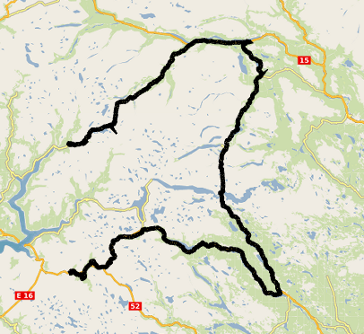

# Velo.gl

Map components and [Deck.gl](https://deck.gl/) layers for rendering GPX tracks.



## Features
* Deck.gl layers
  * GPX Layer - renders the trace of a GPX file
  * Trip GPX Layer - renders the position along a GPX trace at a given time
* Map components
  * GPX Map - renders a GPX trace
  * GPX Maptiler - renders a GPX trace on a Maptiler base map
  * GPX Hill Map - renders a GPX trace on a Maptiler satellite terrain map
  * Focus GPX Map - renders a GPX trace and automatically centers the camera around the bounds of the displayed trace

## Examples
See [Storybook](https://hkfb.github.io/velo.gl/?path=/story/gpx-layer--gpx-layer-default)

## Installation

```sh
npm install velo.gl
```

## Usage
```TSX
import { GpxStreetMap } from "velo.gl";

const MyGpxMap = () => {
  const initialViewState = {
    longitude: 8.3,
    latitude: 61.4,
    zoom: 8
  };
  return <GpxStreetMap gpx={myGpxUrl} initialViewState={initialViewState} />
}
```

## Running Storybook

### Using npm to run locally:
```sh
npm ci
npm run storybook
```

### Using npm & docker:
```sh
npm run docker:storybook
```

### Using npm & docker-compose:
```sh
npm run docker:compose:storybook
```

### Using docker directly:
```sh
docker run --rm -it $(docker build -q .)
```

### Using docker-compose directly:
```sh
docker-compose up --build
```

## Testing

### Using npm with local storybook running:
```sh
npm test:storybook
```

### Using npm & docker-compose:
```sh
npm docker:compose:test
```

